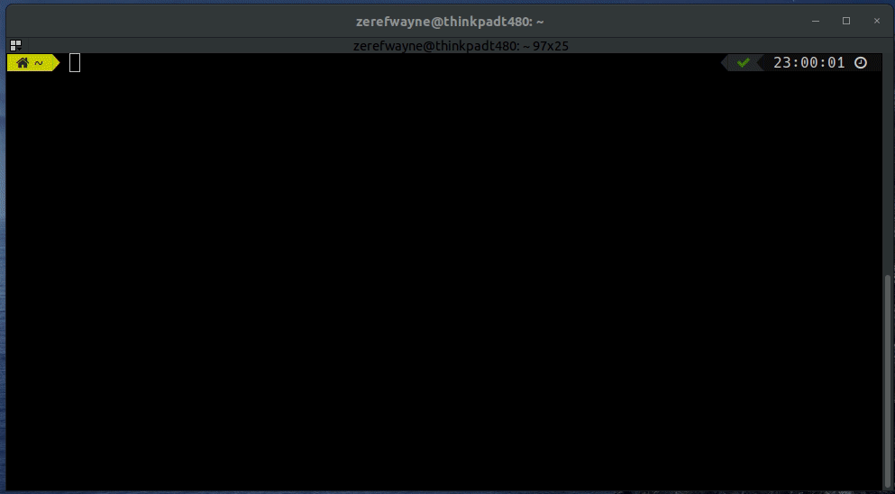
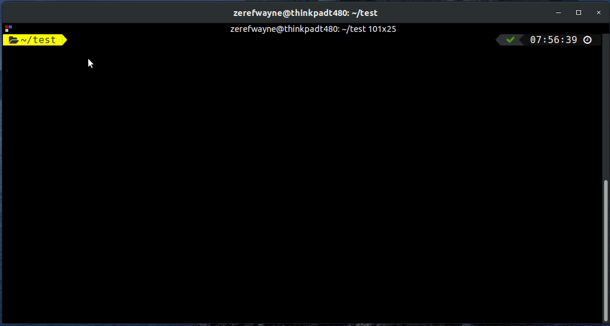

Mifflin is a friendly linux system manager

### Available Commands

### service [start|stop|status] [service-name]

:warning: Under development.

Service command is used to manage the current services installed on the system.

It is a wrapper over the ```systemctl``` command and provides improved functionalities like pattern matching and improved user experience.



### warehouse

:warning: Under development.

Warehouse command can be used to generate your next project from our warehouse of boilerplates.


